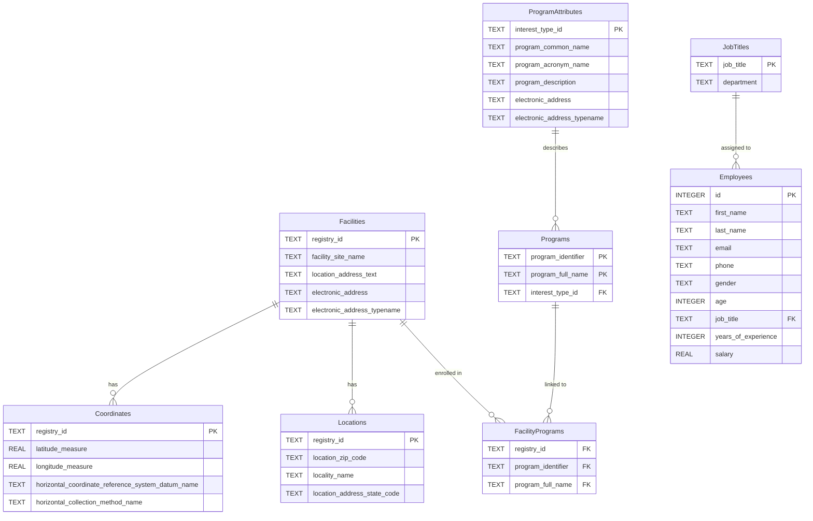
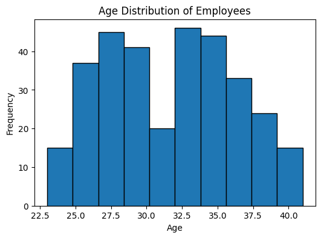
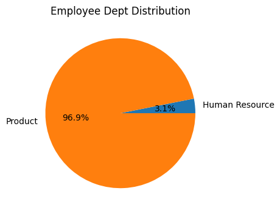

# Database Management System

A GUI-based **Database Management Application** built with **PyQt6** for uploading data from XML and JSON files, viewing summaries, executing custom SQL queries, and visualizing data stored in a SQLite database.  
This project showcases data ingestion, database operations, and interactive visualizations including charts and maps.

---

## Features
- Upload and process XML and JSON data files into SQLite
- Predefined views for data summaries (e.g., Facilities by State, Avg Salary by Job)
- Custom SQL query execution with table-based results
- Data visualizations:
  - Bar charts (e.g., Avg Salary by Job, Facilities per State)
  - Pie charts (e.g., Employee Dept/Job Distribution, Gender Distribution)
  - Histograms (e.g., Age Distribution)
  - Line plots (e.g., Salary vs. Years of Experience)
  - Scatter plots (e.g., Facilities on Map)
- Error logging to `errors.log`
- Includes relational dependency documents and an ER diagram

---

## Tech Stack
**Core**  
- Python  
- PyQt6 (for GUI)  
- SQLite (database)  

**Visualization**  
- Matplotlib  
- Cartopy (for mapping)  

**Others**  
- xml.etree.ElementTree (XML parsing)  
- json (JSON parsing)  
- logging (error handling)  

---

## Project Structure
```
database-management-app/
├── app.py                      # Main application script (Python code with PyQt6 GUI)
├── requirements.txt            # List of Python dependencies
├── README.md                   # Project documentation and setup instructions
├── docs/                       # Directory for documentation and relational files
│   ├── RD_Program.txt          # Relational dependencies for Programs
│   ├── RD_Facility.txt         # Relational dependencies for Facilities
│   ├── RD_Employees.txt        # Relational dependencies for Employees
│   └── erDiagram.mmd           # ER diagram in Mermaid format
├── data.zip
└── screenshots/                # Optional directory for storing visualization outputs
    # age_distribution.png      # Example plot image (generated by app)
    # employee_dept_distribution.png  # Example plot image
    # facilities_per_state.png  # Example plot image
    # salary_vs_experience.png  # Example plot image

```

**Notes on Structure:**
- Place `app.py` in the root for easy execution.
- Use `docs/` for supporting files like relational dependencies and ER diagrams.
- The `data/` folder is for dataset files (`EPAXML.xml`, `project.json`) and the generated `project.db`.
  ```
 

---

## Installation & Setup

### Install Dependencies
Set up a virtual environment (optional but recommended):
```bash
python -m venv venv
source venv/bin/activate  # On Windows: venv\Scripts\activate
```

Install required packages from `requirements.txt`:
```bash
pip install -r requirements.txt
```

**Sample `requirements.txt`**:
```
PyQt6
matplotlib
cartopy
```

###  Download Dataset Files
The app requires dataset files to populate the database. Download the zipped data folder and extract it into the project root:
- [data.zip (~350MB estimated)](https://drive.google.com/file/d/1R9TrYUJRel53VA3pgufK7jiAOU-ANAXC/view?usp=sharing) (contains EPAXML.xml, project.json, and project.db)

Extract the zip file:
```bash
unzip data.zip
```

### Run the Application
```bash
python app.py
```
- On first run, `project.db` (approx. 80MB) will be created by processing the dataset files.
- Use the "Upload Files" tab to load `EPAXML.xml` and `project.json` to initialize the database.
- Access tabs for Upload, Views, SQL Query, and Visualization.

**Requirements**: Ensure at least 400MB of free space for datasets and the database.

---

## Usage

### Upload Files
- Navigate to the "Upload Files" tab.
- Click "Upload XML" or "Upload JSON" to import `EPAXML.xml` or `project.json`.
- Data is stored in the SQLite database.

### Views
- In the "Views" tab, select buttons to display predefined summaries (e.g., Facilities by State).

### SQL Query
- In the "SQL Query" tab, enter a SQL query and click "Run Query" to see results.

### Visualization
- In the "Visualization" tab, click buttons to generate plots (e.g., Age Distribution, Salary vs. Experience).
- Plots display in a dialog and save as PNG files.

### ER Diagram
Check the ER diagram in `docs/erDiagram.mmd` (Mermaid format). Render it at [mermaid.live](https://mermaid.live):



---

## Screenshots
*(Add images of the app interface and plots here, e.g.:)*
- Age Distribution: 
- Employee Dept Pie: 

---

## Development Notes
- **Database**: Tables (Facilities, Coordinates, etc.) are created on startup.
- **Visualizations**: Uses Matplotlib for charts; Cartopy for maps (current impl uses scatter).
- **Errors**: Logged to `errors.log`; displayed via message boxes.
- **Enhancements**: Consider adding validation or export options.

---